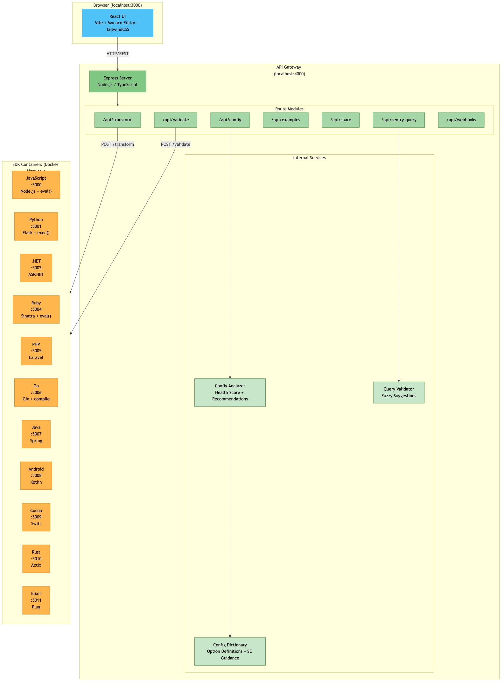
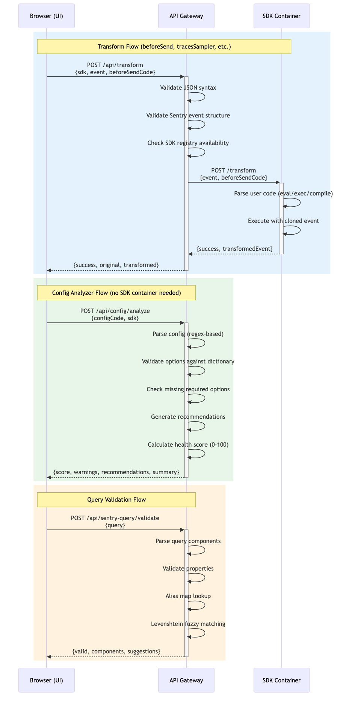
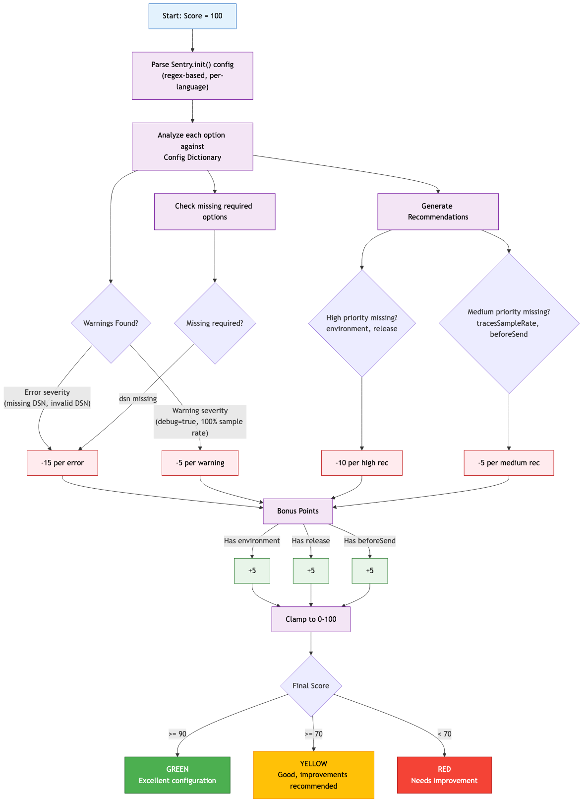

# Architecture Deep Dive

> Detailed technical documentation of the SDK Playground's system architecture, request flows, health scoring, and suggestion systems.

## Table of Contents

- [System Architecture](#system-architecture)
- [Startup Sequence](#startup-sequence)
- [Request Flows](#request-flows)
  - [Transform Flow](#transform-flow)
  - [Config Analyzer Flow](#config-analyzer-flow)
  - [Query Validation Flow](#query-validation-flow)
- [Introspection-First Design](#introspection-first-design)
  - [Motivation](#motivation)
  - [Two-Source Resolution](#two-source-resolution)
  - [JSON Dictionary](#json-dictionary)
  - [Scaffold Tool](#scaffold-tool)
- [Health Score System](#health-score-system)
  - [Scoring Algorithm](#scoring-algorithm)
  - [Warning Sources](#warning-sources)
  - [UI Rendering](#ui-rendering)
- [Suggestions & Recommendations](#suggestions--recommendations)
  - [Config Recommendations](#config-recommendations)
  - [Query Suggestions](#query-suggestions)
- [Container Interaction Patterns](#container-interaction-patterns)
- [Key File Reference](#key-file-reference)

---

## System Architecture

The SDK Playground is a **3-tier Docker microservices architecture** consisting of a React frontend, a Node.js/Express API gateway, and 11 language-specific SDK containers, all connected via a shared Docker bridge network.



**Three tiers:**

| Tier | Technology | Port | Role |
|------|-----------|------|------|
| **UI** | React + Vite + Monaco Editor + TailwindCSS | 3000 | Browser-based IDE with 9 playground modes |
| **API Gateway** | Node.js + Express + TypeScript | 4000 | Routing, validation, config analysis, query validation |
| **SDK Containers** | 11 language runtimes (Node, Python, Go, Ruby, etc.) | 5000-5011 | Execute user-provided code in native runtimes |

All containers share the `sdk-playground-network` Docker bridge network. The API reaches SDK containers by Docker service name (e.g., `http://sdk-javascript:5000`). The browser communicates with the API via `localhost:4000`.

---

## Startup Sequence

When `docker-compose up` runs, services start in dependency order:

```
docker-compose up
       |
       +---> 11 SDK Containers start first (ports 5000-5011)
       |       JavaScript, Python, Go, Ruby, PHP, .NET,
       |       Java, Android, Cocoa, Rust, Elixir
       |
       +---> API Gateway starts (port 4000)
       |       depends_on: all SDK containers
       |       Mounts 7 route modules
       |       Loads JSON dictionary from api/config-dictionary/
       |
       +---> UI starts last (port 3000)
               depends_on: api
               Vite dev server with hot reload
```

**API Gateway initialization** (`api/src/index.ts`):
1. Configures Express with CORS and JSON body parsing (10MB limit)
2. Registers `/health` endpoint
3. Mounts 7 route modules: `/api/transform`, `/api/validate`, `/api/config`, `/api/examples`, `/api/share`, `/api/sentry-query`, `/api/webhooks`

**SDK container URLs** are injected via environment variables in `docker-compose.yml`:
```
JAVASCRIPT_SDK_URL=http://sdk-javascript:5000
PYTHON_SDK_URL=http://sdk-python:5001
DOTNET_SDK_URL=http://sdk-dotnet:5002
...etc
```

---

## Request Flows



### Transform Flow

The primary feature — executes user-provided `beforeSend`, `tracesSampler`, and other callback code against sample events in native SDK runtimes.

**Path:** `UI -> POST /api/transform -> SDK Container -> Response`

1. **UI** sends `{ sdk, event, beforeSendCode }` to `POST /api/transform` (30s timeout)
2. **API Gateway** (`api/src/routes/transform.ts`):
   - Validates JSON syntax via `validateJSON()`
   - Validates Sentry event structure via `validateSentryEvent()`
   - Checks SDK availability in `sdks/registry.json`
   - Routes to the correct SDK client via switch statement
3. **SDK Client** (`api/src/sdk-clients/<language>.ts`) makes HTTP POST to `http://sdk-<language>:<port>/transform` (10s timeout)
4. **SDK Container** executes user code in its native runtime:

| SDK | Runtime | Execution Method |
|-----|---------|-----------------|
| JavaScript | Node.js 20 | `eval()` |
| Python | Python 3.12 | `exec()` |
| Go | Go 1.21 | Writes temp file, `go build`, executes binary |
| Ruby | Ruby 3.2 | `eval()` to get lambda/proc |
| .NET | .NET 8 | Dynamic compilation |
| Java/Android | JVM | Groovy scripting engine |

### Config Analyzer Flow

Validates `Sentry.init()` configurations and produces health scores + recommendations. Uses an **introspection-first** strategy that checks options against both a JSON dictionary and live SDK containers.

**Path:** `UI -> POST /api/config/analyze -> Config Analyzer -> (optional) SDK Container /introspect -> Response`


1. **UI** sends `{ configCode, sdk }` to `POST /api/config/analyze`
2. **Config Route** (`api/src/routes/config.ts`) selects the appropriate `ConfigAnalyzer` instance
3. **ConfigAnalyzer** (`api/src/config-analyzer/analyzer.ts`) runs the async `analyze()` pipeline:
   - **Parse** config using a language-specific `IConfigParser` (regex-based)
   - **First pass**: Analyze each option against the `ConfigDictionary` (JSON files)
   - **Second pass** (if unknowns exist): Fetch introspection from SDK container (`GET /introspect`, called **once**), re-analyze unknown options
   - Check for missing required options
   - Generate recommendations
   - Calculate health score
   - Generate summary text
4. Returns `{ score, warnings, recommendations, summary, options }`

**Introspection is only called when needed** — if all options are in the dictionary, no SDK container request is made. If introspection fails (container down, timeout), the analyzer gracefully degrades to dictionary-only behavior.

### Query Validation Flow

Validates Sentry search queries and suggests corrections for typos.

**Path:** `UI -> POST /api/sentry-query/validate -> Query Validator -> Response`

1. **UI** sends `{ query }` to `POST /api/sentry-query/validate`
2. **Query Validator** (`api/src/sentry-query/query-validator.ts`):
   - Parses query into components
   - Validates each property against known valid properties
   - Checks alias map for common alternatives
   - Runs Levenshtein distance fuzzy matching for typos
3. Returns `{ valid, components, suggestions }`

---

## Introspection-First Design

### Motivation

Previously, a static TypeScript dictionary was the **sole gatekeeper** for option recognition. Every time an SDK added or changed an option, the dictionary would drift, producing false positive "Unknown option" warnings. The root cause was architectural: **option existence** and **option metadata** were conflated in a single static store.

The introspection-first design separates these concerns:
- **Existence** → determined by the SDK itself (via `/introspect` endpoint)
- **Metadata** → provided by the dictionary (SE guidance, warnings, examples)

### Two-Source Resolution

```
Option → Dictionary lookup
  → Found? → source='dictionary', use rich metadata ✅
  → Not found? → Check introspection data (pre-fetched once per analyze call)
      → Found in SDK? → source='introspection', recognized=true, info note ✅
      → Not found? → recognized=false, "Unknown option" warning ⚠️
```

This means:
- **Zero false positives** for SDK-supported options (even if dictionary is incomplete)
- **Rich metadata** for curated options (SE guidance, warnings, examples)
- **Graceful degradation** if SDK containers are down (falls back to dictionary-only)
- **Info notes** when an option is recognized via introspection, prompting dictionary curation

### JSON Dictionary

The dictionary was migrated from 9 TypeScript files to 9 JSON files at `api/config-dictionary/`. This provides:

- **Data/code separation** — option definitions are data, not logic
- **No TypeScript rebuild required** — edit JSON, rebuild Docker, done
- **Clean diffs** — JSON changes are easy to review
- **Testability** — `ConfigDictionary` constructor accepts a custom directory

The `ConfigDictionary` class loads all `.json` files at startup:

```typescript
class ConfigDictionary {
  constructor(dictionaryDir?: string) {
    const dir = dictionaryDir || path.join(__dirname, '../../config-dictionary');
    const allOptions = this.loadOptionsFromDir(dir);
    // Build lookup maps...
  }
}
```

JSON `null` for `supportedSDKs` is converted to `undefined` at load time (meaning "all SDKs supported").

### Scaffold Tool

The scaffold endpoint bridges the gap between introspection and dictionary:

```
GET /api/config/dictionary/scaffold/:sdk
```

It introspects the SDK, compares against the dictionary, and generates stub `ConfigOption` entries for options not yet in the dictionary. Stubs pre-fill `key`, `type`, `description`, and `supportedSDKs` from introspection, leaving `seGuidance`, `warnings`, and `examples` empty for human curation.

Related endpoints:
- `GET /api/config/introspect/:sdk` — raw introspection data
- `GET /api/config/dictionary/sync/:sdk` — dictionary vs introspection coverage comparison
- `POST /api/config/validate-live` — validate config against the real SDK

---

## Health Score System



The health score evaluates `Sentry.init()` configurations on a 0-100 scale. It lives entirely in `api/src/config-analyzer/analyzer.ts`.

### Scoring Algorithm

The `calculateScore()` method starts at 100 and applies deductions and bonuses:

| Factor | Impact | Examples |
|--------|--------|----------|
| Error-severity warnings | **-15 each** | Missing DSN, DSN not HTTPS, invalid sample rate |
| Warning-severity warnings | **-5 each** | `debug: true`, 100% `tracesSampleRate`, `sendDefaultPii: true` |
| High-priority missing recommendations | **-10 each** | Missing `environment`, missing `release` |
| Medium-priority missing recommendations | **-5 each** | Missing `tracesSampleRate`, missing `beforeSend` |
| Has `environment` set | **+5 bonus** | |
| Has `release` set | **+5 bonus** | |
| Has `beforeSend` set | **+5 bonus** | |

Final score is clamped to `[0, 100]`.

### Warning Sources

Warnings are generated from three analysis phases:

**1. Option Analysis** (`analyzeOption()`):
- Unknown options not in the Config Dictionary **and** not in SDK introspection
- Options not supported in the selected SDK
- Predefined warnings from dictionary entries
- Options recognized via introspection but not yet in dictionary (info-level)

**2. Value Validation** (`validateOptionValue()`):
- **DSN**: must start with `https://`, must contain `@` and `.ingest`
- **Sample rates** (`sampleRate`, `tracesSampleRate`, `profilesSampleRate`): must be 0.0-1.0; 100% `tracesSampleRate` triggers a warning
- **`debug: true`**: warns about production impact
- **`sendDefaultPii: true`**: warns about privacy/GDPR implications

**3. Missing Required Options** (`checkMissingRequired()`):
- Currently only `dsn` is marked as required in `api/config-dictionary/core.json`

### UI Rendering

The score is displayed in `ui/src/components/playgrounds/ConfigAnalyzerPlayground.tsx`:

| Score | Color | Label |
|-------|-------|-------|
| >= 90 | Green | "Excellent configuration" |
| >= 70 | Yellow | "Good configuration, some improvements recommended" |
| < 70 | Red | "Configuration needs improvement" |

---

## Suggestions & Recommendations

The playground has **two independent suggestion systems** serving different modes.

### Config Recommendations

Generated by `generateRecommendations()` in the Config Analyzer. These check if best-practice options are **absent** from the user's config:

| Missing Option | Priority | Recommendation Title |
|----------------|----------|---------------------|
| `environment` | **high** | "Set environment" |
| `release` | **high** | "Set release version" |
| `tracesSampleRate` + `enableTracing` | **medium** | "Enable performance monitoring" |
| `beforeSend` | **medium** | "Add beforeSend for PII scrubbing" |
| `ignoreErrors` | **low** | "Filter known errors with ignoreErrors" |

Each recommendation includes a **code example dynamically formatted for the target SDK** using `sdk-config.ts`:
- Python/Ruby/PHP/Rust/Elixir: `snake_case` keys (e.g., `traces_sample_rate`)
- JavaScript/Java/.NET: `camelCase` keys (e.g., `tracesSampleRate`)
- Language-appropriate assignment operators and comment syntax

The `ConfigDictionary` also provides **SE Guidance** text for each option — expert advice from Solutions Engineering on when and how to use each option (e.g., `beforeSend` guidance: *"Primary tool for PII scrubbing and event filtering. Return null to drop events."*).

### Query Suggestions

Generated by the Query Validator (`api/src/sentry-query/query-validator.ts`) for the API Query Tester mode. Two-layer suggestion system:

**Layer 1 — Alias Map**: Hardcoded mappings for common mistakes:
```
assignee    -> assigned
lvl         -> level
severity    -> level
status      -> is
env         -> environment
user_id     -> user.id
user_email  -> user.email
error_type  -> error.type
```

**Layer 2 — Fuzzy Matching**: Levenshtein edit distance against all valid Sentry properties. Returns the closest match if distance <= 3.

---

## Container Interaction Patterns

### Network Topology

```
Browser (localhost)
    |
    | port 3000 (UI), port 4000 (API)
    v
+-------------------------------------------+
|        Docker Bridge Network              |
|        (sdk-playground-network)           |
|                                           |
|  api (4000)                               |
|    |                                      |
|    +--- sdk-javascript (5000)             |
|    +--- sdk-python (5001)                 |
|    +--- sdk-dotnet (5002)                 |
|    +--- sdk-ruby (5004)                   |
|    +--- sdk-php (5005)                    |
|    +--- sdk-go (5006)                     |
|    +--- sdk-java (5007)                   |
|    +--- sdk-android (5008)                |
|    +--- sdk-cocoa (5009)                  |
|    +--- sdk-rust (5010)                   |
|    +--- sdk-elixir (5011)                 |
|                                           |
|  ui (3000)                                |
+-------------------------------------------+
```

### SDK Client Pattern

All SDK clients in `api/src/sdk-clients/` follow an identical pattern:
1. Read SDK URL from environment variable (with fallback to Docker hostname)
2. Export a `transformWith<Language>()` async function
3. Make an axios POST to `<SDK_URL>/transform` with 10-second timeout
4. Return `{ success, transformedEvent, error }` with error handling

### Health Check Pattern

Every container exposes a `GET /health` endpoint returning `{ status: "healthy", sdk: "<name>" }`. The API gateway aggregates these for service discovery and monitoring.

### Introspection Pattern

SDK containers that support introspection expose a `GET /introspect` endpoint returning:

```json
{
  "sdk": "python",
  "sdkVersion": "2.0.0",
  "sdkPackage": "sentry-sdk",
  "source": "reflection",
  "options": [
    { "key": "dsn", "canonicalKey": "dsn", "type": "string", "required": true, "default": null, "description": "..." }
  ],
  "timestamp": "2024-01-01T00:00:00Z"
}
```

Introspection sources vary by SDK:
- **Reflection** (Python, JS, Ruby, etc.) — inspects SDK at runtime
- **Manifest** (Cocoa) — static list maintained in `routes.swift`

---

## Key File Reference

| File | Purpose |
|------|---------|
| `docker-compose.yml` | Orchestration for all 13 services |
| `sdks/registry.json` | SDK metadata: names, ports, status, packages |
| `api/src/index.ts` | Express app entry point, route mounting |
| `api/src/routes/transform.ts` | Main transform endpoint (beforeSend testing) |
| `api/src/routes/config.ts` | Config analyzer + introspection + scaffold endpoints |
| `api/src/routes/sentry-query.ts` | Query validation endpoint |
| `api/config-dictionary/*.json` | **JSON option definitions (9 category files)** |
| `api/src/config-dictionary/index.ts` | JSON loader, ConfigDictionary class |
| `api/src/config-dictionary/types.ts` | ConfigOption type definitions |
| `api/src/config-analyzer/analyzer.ts` | **Health score algorithm + introspection fallback** |
| `api/src/config-analyzer/sdk-config.ts` | Per-language syntax formatting |
| `api/src/config-analyzer/types.ts` | AnalysisResult, OptionAnalysis (with `source` field) |
| `api/src/sdk-introspection/sdk-introspector.ts` | HTTP client for SDK `/introspect` endpoints |
| `api/src/sdk-introspection/config-validator.ts` | Live config validation against SDK containers |
| `api/src/sdk-introspection/dictionary-sync.ts` | Dictionary vs introspection comparison |
| `api/src/sdk-introspection/scaffold.ts` | Stub generation for uncurated options |
| `api/src/config-parsers/javascript.ts` | JavaScript config parser (regex-based) |
| `api/src/sentry-query/query-validator.ts` | **Query validation + fuzzy suggestions** |
| `api/src/sdk-clients/*.ts` | HTTP clients for each SDK container |
| `sdks/javascript/src/index.ts` | JavaScript SDK container (Express + eval) |
| `sdks/python/app.py` | Python SDK container (Flask + exec) |
| `sdks/go/main.go` | Go SDK container (Gin + compile) |
| `sdks/ruby/app.rb` | Ruby SDK container (Sinatra + eval) |
| `sdks/cocoa/Sources/App/routes.swift` | Cocoa SDK container (manifest-based introspection) |
| `ui/src/components/playgrounds/ConfigAnalyzerPlayground.tsx` | Health score UI rendering |
| `ui/src/api/client.ts` | Frontend API client |
| `ui/src/types/modes.ts` | 9 playground mode definitions |
